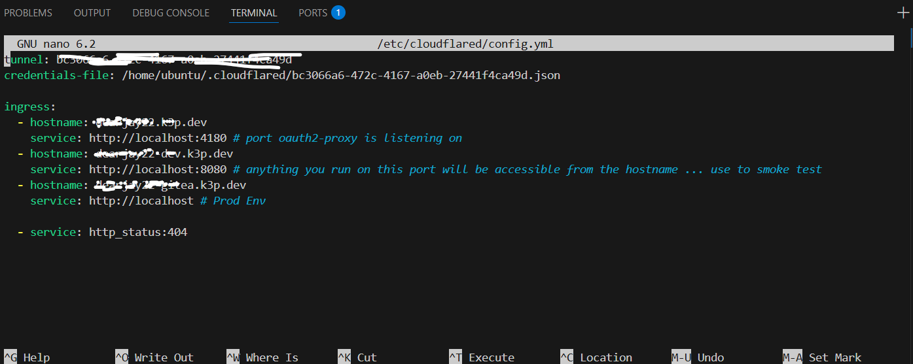
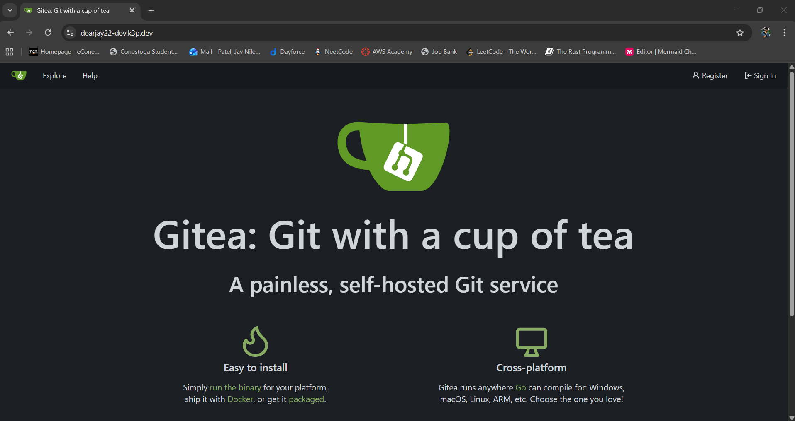
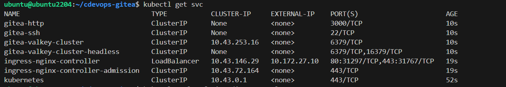
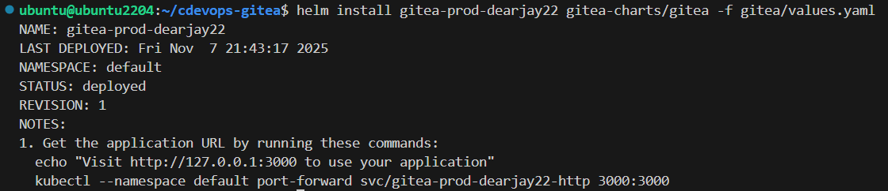
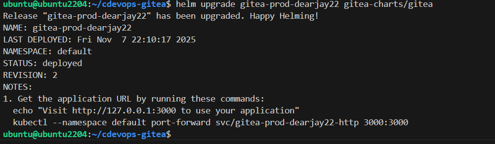
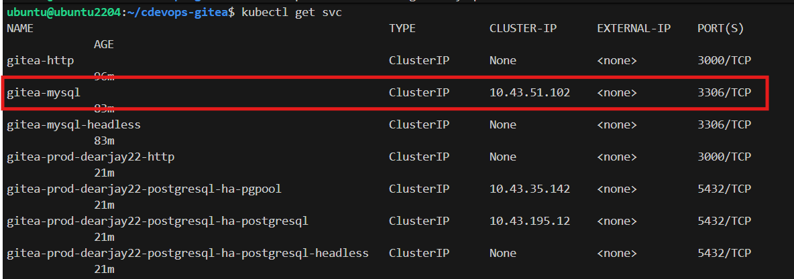
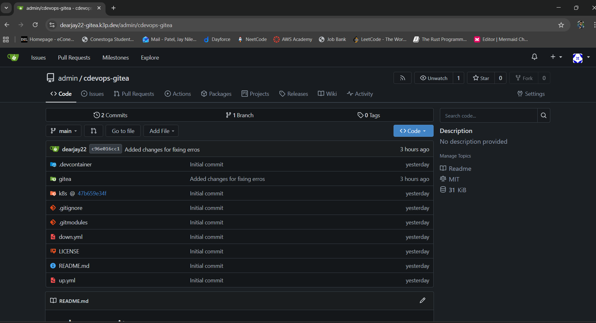

# cdevops-gitea
k8s gitea lab to take dev (sqlite based) to prod (mysql based)

TLDR;

```bash
pip install ansible kubernetes
git submodule update --init --recursive
ansible-playbook up.yml
```

Wait until `kubectl get pod` shows all pods running and:

```bash
kubectl port-forward svc/gitea-http 3000:3000
```
# For setup

```bash
sudo nano /etc/cloudflared/config.yml
```


```bash
cloudflared tunnel route dns <tunnel-uuid> <your-domain>
```

# For Dev
```bash
kubectl port-forward svc/gitea-http 8080:3000
```



# For Prod Env 
Just apply
```bash
kubectl apply -f gitea/ingress.yml
```


Check is External Ip assigned


If it says Pending for "ingress-nginx-controller"

```bash
ansible-playbook down.yml
```

```bash
ansible-playbook up.yml
```

```bash
kubectl apply -f gitea/ingress.yml
```


# Use the gitea helm to make the repository data persistent and Use of gitea for external database

```bash
helm repo add bitnami https://charts.bitnami.com/bitnami
```

```bash
helm install gitea-mysql bitnami/mysql \
  --set auth.rootPassword=root123 \
  --set auth.database=gitea \
  --set auth.username=gitea \
  --set auth.password=gitea_pass \
  --set primary.persistence.enabled=true
```

```bash
helm install gitea-prod-dearjay22 gitea-charts/gitea -f gitea/values.yaml
```



# Expose Gitea publicly

```bash
kubectl apply -f gitea/ingress.yml
```

# Verify


```bash
kubectl get ingress

kubectl get svc
```

I have created account in gitea and pull my repo from github.

Also I have my-sql service running.






